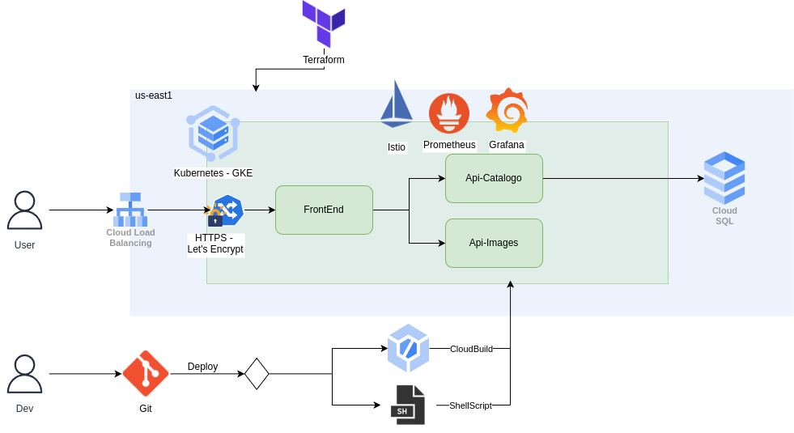
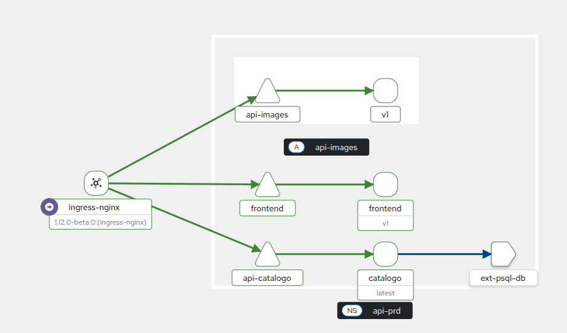
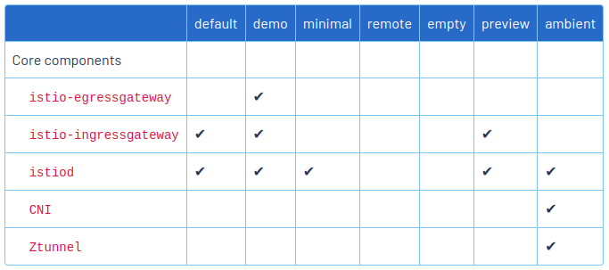

### Objetivos
 - Implantação GKE ou Local com ShellScript ou Pipeline CloudBuild
 - Aplicar Certificados TLS (Let's Ebcrypt) para https.
 - Aplicar Istio para Service Mesh.
 - Aplicar Prometheus e Grafana para observabilidade
 - Infraestrutura GKE com Terraform usando modulos.


### Repositórios relacionados 
- [Frontend](https://github.com/Adenilson365/devopslabs01-frontend)
- [BackEnd - Api-Images](https://github.com/Adenilson365/devopslabs01-api-images)
- [BackEnd - Api-Catalogo](https://github.com/Adenilson365/devopslabs01-serviceMesh)
- [Terraform - Infra](https://github.com/Adenilson365/devopslabs01-iac)


### Diagrama de arquitetura


### Diagrama do ServiceMesh


### Documentação
- [cert-manager](https://cert-manager.io/)
- [LetsEncrypt](https://letsencrypt.org/)
- [Ingress Nginx](https://kubernetes.github.io/ingress-nginx/deploy/#gce-gke)
- [Istio - Service Mesh](https://istio.io/)
- [Stack Prometheus + Grafana](https://artifacthub.io/packages/helm/prometheus-community/kube-prometheus-stack)

### Configuração inícial do Cluster
- Execute o terraform ou crie um cluster GKE [Repositório de IAC](https://github.com/Adenilson365/devopslabs01-iac)
- Instale a CNI ingress-nginx
- Instale a CLI do Istio 
- Aplique os arquivos de configuração 
  - Secrets
  - ConfigMaps
  - Ingress Controller
  - PersistentVolumeClaim
### É possível realizar a instalação executando o script ./config.sh

### Como Configurar HTTPS
- Instale o cert-manager seguindo a documentação cert-manager.
- Crie o kind ClusterIssuer seguindo: [Documentação](https://cert-manager.io/docs/tutorials/acme/nginx-ingress/)
- Adicione as configurações de Annotations e spec.tls, ainda seguin a documentação do passo anterior
```YAML
apiVersion: networking.k8s.io/v1
kind: Ingress
metadata:
  name: devopslabs
  annotations:
   cert-manager.io/cluster-issuer: letsencrypt-prod
spec:
  ingressClassName: nginx
  tls:
    - hosts:
        - meudominio.com.br
      secretName: letsencrypt-prod
```
- Pronto - HTTPS configurado.

### Intalar Istio
- [LINK](https://istio.io/latest/docs/ambient/install/platform-prerequisites/) - Aplique a configuração específica para o Kubernetes, neste projeto GKE.
- [LINK](https://istio.io/latest/docs/ambient/install/helm/) - Instale os componentes base do Istio via Helm
- [LINK](https://istio.io/latest/docs/ops/integrations/kiali/#installation) - Instale o Kiali Dashboard

- Após instalar os componentes injete a label no namespace da aplicação.
  - Novos pods terão sidecar de proxy do istio, pods existentes precisarão ser recriados.
```
kubectl label namespace <NomeNamespace> istio-injection=enabled
```
- Instalado o profile ambient



### Variáveis de ambiente
- Secrets 
```YAML
apiVersion: v1 
kind: Secret
metadata:
  name: db-secret
type: Opaque
data:
  POSTGRES_USER: valor
  POSTGRES_PASSWORD: valor
  POSTGRES_DB: valor
---
apiVersion: v1
kind: Secret
metadata:
  name: catalogo-secret
type: Opaque
data:
  DB_HOST: valor
  DB_USER: valor
  DB_PASSWORD: valor
  DB_DATABASE: valor
```
- Configmaps: 
```YAML
apiVersion: v1 
kind: ConfigMap
metadata:
  name: db-config
  namespace: api-prd
data:
  DB_HOST: "IP Banco de Dados GCP ou Nome Serviço PSQL local"
  PGDATA: "/var/lib/postgresql/data/db"
---


```
```shell
#Como colocar em base64 para o secret
echo -d 'valor' | base64 
```


### Scripts úteis

- Criar e popular tabela no banco de dados.
